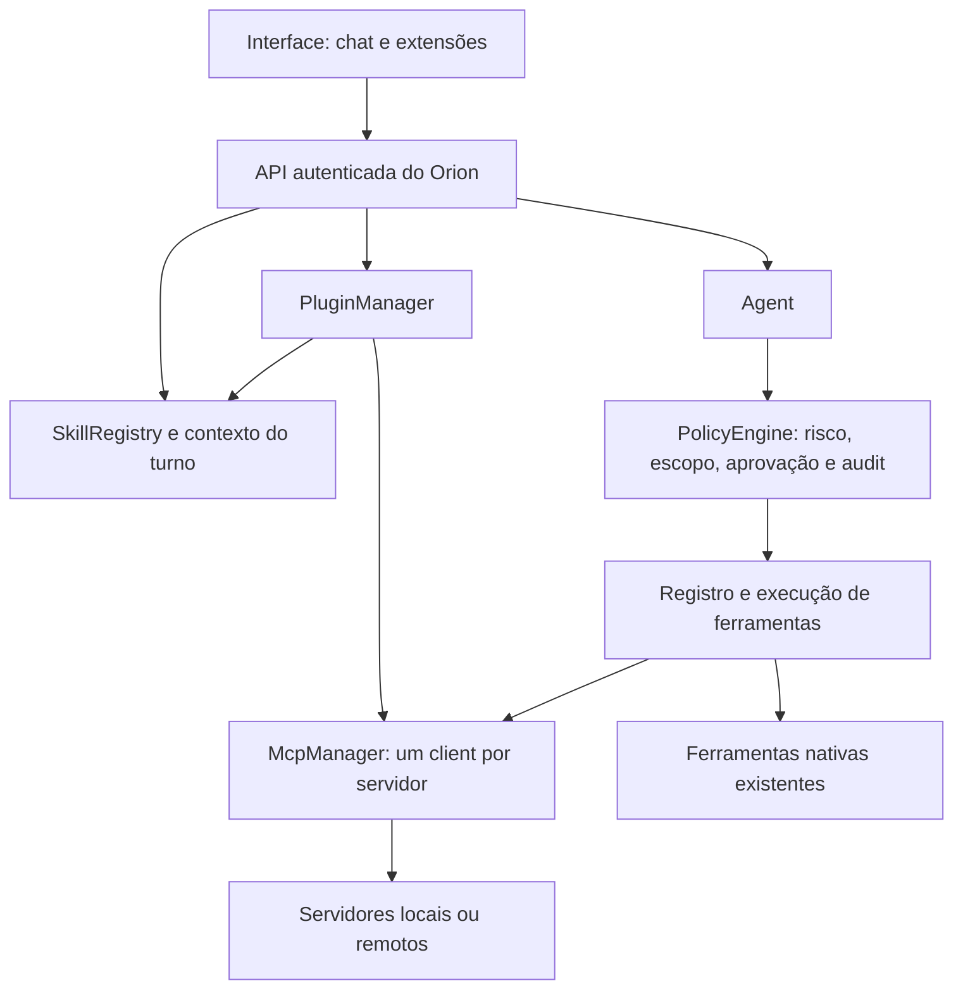

# Orion — referências de produto e plano de extensões

Pesquisa em 04/10/2026. **Plano de implementação com C00–C29 concluídos** (registro na seção 9).
Plugins e skills seguem em implementação. MCP já tem prova com servidores controlados;
nenhuma conta pessoal ou servidor externo do usuário foi conectado.
Complementa [ORION_FRONT.md](ORION_FRONT.md), as fases 4 e 6 do
[ORION_NUCLEO.md](ORION_NUCLEO.md) e a triagem de [ORION_FERRAMENTAS.md](ORION_FERRAMENTAS.md).
As regras de [ORION_REGRAS.md](ORION_REGRAS.md) continuam valendo.

## Direção recomendada

O próximo salto do Orion é virar um espaço de trabalho pessoal: conversas organizadas,
contexto por projeto, arquivos produzidos fáceis de encontrar e capacidades que o usuário
consegue instalar, entender e controlar. A aparência deve continuar sendo o observatório
noturno, com a constelação na abertura, azul Rigel nas ações e âmbar para atenção.

A ordem recomendada é **contrato do backend → cliente MCP → skills → plugins → interface de
extensões → projetos e biblioteca de resultados**. Não começar por uma loja visual sem runtime.
As melhorias de navegação e conversa podem ser entregues junto das primeiras etapas.

### Correção do aviso esclarecida

O aviso relatado era **“Cérebro de volta”**. Em `js/sidebar.js`, o mesmo estado `online` era
alterado tanto pelo ping quanto pelo carregamento de sessões. Uma falha em `/sessoes` seguida
de ping bem-sucedido podia ser interpretada como reconexão e disparar esse toast repetidamente.
A correção anterior separou esses estados, removeu os toasts de conexão, impediu pings
concorrentes e estabilizou os indicadores. “Cérebro conectado” era o indicador separado da home,
também removido para evitar duplicação. Os testes de regressão cobrem esses caminhos.

## 1. Referências pesquisadas

Foram consultadas páginas oficiais pela rede e comparadas com o código local. A pesquisa
não equivale a testar pessoalmente todas as versões dos aplicativos. Disponibilidade de
recursos varia por plano, plataforma e rollout; o plano abaixo aproveita os padrões de produto.

| Referência | O que foi confirmado | Aplicação no Orion |
|---|---|---|
| [Codex/ChatGPT: projetos e chats](https://learn.chatgpt.com/docs/projects) | Organização de chats, arquivos, fontes e instruções por projeto | Projeto como contexto explícito, sem misturar todo o histórico |
| [Codex/ChatGPT: arquivos](https://learn.chatgpt.com/docs/artifacts-viewer) | Prévia ao lado do chat, inspeção do arquivo e revisão dirigida | Biblioteca de resultados e painel lateral de documento/código |
| [Codex/ChatGPT: notificações](https://learn.chatgpt.com/docs/notifications) | Notificações configuráveis e atividade que demanda atenção | Painel de atividade; reconexão saudável não gera popup |
| [Codex/ChatGPT: plugins](https://learn.chatgpt.com/docs/plugins) | Pacotes de capacidades com skills e servidores MCP; instalar é diferente de conectar e autorizar | Ciclo de instalação, ativação e permissões visível |
| [OpenAI: skills](https://learn.chatgpt.com/docs/build-skills) | Metadados primeiro, `SKILL.md` completo somente quando necessário | Skills com carregamento gradual e escopo claro |
| [Claude: projetos](https://support.claude.com/en/articles/9517075-what-are-projects) | Conhecimento e instruções compartilhados por projeto | Arquivos e instruções por projeto; a variante nova de projetos descrita na página é beta |
| [Claude: artifacts](https://support.claude.com/en/articles/17153992-what-are-artifacts-and-how-do-i-use-them) | Resultados próprios, edição e continuidade fora da prosa da conversa | Resultado persistente, com origem e versões |
| [Claude Code: plugins](https://code.claude.com/docs/en/plugins) | Um pacote reúne skills, MCP e outros componentes; namespace e distribuição versionada | Pacote Orion versionado, sem presumir compatibilidade integral com Claude Code |
| [Claude Code: skills](https://code.claude.com/docs/en/skills) e [MCP](https://code.claude.com/docs/en/mcp) | Invocação de skills e gestão de ferramentas/conexões | Invocação explícita, descoberta sob demanda e diagnóstico de conexão |
| [Agent Skills: especificação](https://agentskills.io/specification) | Formato `SKILL.md`, frontmatter, referências/scripts/assets e carregamento gradual | Reutilizar o padrão aberto em vez de inventar outro formato de skill |
| [MCP: arquitetura](https://modelcontextprotocol.io/docs/2026-07-28/learn/architecture) | Host, clients, servers; tools/resources/prompts; stdio e Streamable HTTP | Orion como host, com clientes no backend |
| [MCP: segurança](https://modelcontextprotocol.io/docs/2026-07-28/tutorials/security/security_best_practices) e [SDK Python](https://github.com/modelcontextprotocol/python-sdk) | Autorização, escopos, riscos de servidores locais e SDK para clientes/servidores | Reutilizar SDK e política Orion, sem implementar JSON-RPC à mão |

**Nota de versão:** a documentação MCP consultada identifica `2026-07-28` como versão atual.
Ela descreve `server/discover`, metadados por request e mudanças em relação a versões anteriores.
Não copiar um tutorial antigo de `initialize` como se fosse universal. O primeiro spike deve
fixar a versão do SDK realmente disponível, provar os protocolos suportados e registrar a
matriz de compatibilidade. O README do SDK consultado aponta para documentação v2; isso não
substitui a verificação do pacote publicado. SSE legado só entra se houver necessidade comprovada.

## 2. O que já existe e o que falta

| Área | Evidência no Orion | Próxima melhoria | Prioridade |
|---|---|---|---|
| Integração front/backend | C01–C06 entregam capacidades, sessões, histórico, exportação, limpeza, gestão e busca de conversas por canal. Métricas, uploads e voz continuam ausentes | Preparar MCP a partir de C07, mantendo flags coerentes com rotas reais | P0 |
| Conexão e avisos | C00–C02 corrigem o toast e separam API acessível, modelo configurado e recursos disponíveis | Manter reconexão silenciosa e ampliar o painel de atividade nos checklists seguintes | P1 |
| Conversas | Criar, listar, buscar e trocar existem; busca atual depende da lista de títulos | Menu renomear/fixar/arquivar, busca por conteúdo no backend e preservação de foco durante polling | P1 |
| Edição e versões | Copiar, ouvir e gerar novamente a última resposta já existem | Editar pedido com nova versão; escolher versões sem apagar o caminho anterior | P2 |
| Projetos | Sessões por canal existem; não há entidade de projeto | Projetos com chats, fontes, instruções e escopo de memória | P1 |
| Resultados | Markdown, código copiável, imagem local e exportação existem | Biblioteca persistente, prévia lateral, origem, versões e download | P1 |
| Ferramentas em execução | Chips de ferramenta, erro e cartão de aprovação existem | Atividade expansível com início/fim, resultado resumido e ação para resolver falhas | P1 |
| Fontes da resposta | C04 mostra fontes e ferramentas no histórico e preserva timestamps/proveniência na exportação; o SSE ainda não entrega todos esses dados à UI | Completar a proveniência das respostas novas (C27) | P1 |
| Integrações | `views/integrations.js` tem seis itens fixos | Catálogo real de extensões, conexão de contas e escolha das capacidades por projeto/chat | P1 |
| Skills | Não há loader de `SKILL.md` em `orion/` | Descoberta, invocação e carregamento gradual, com rastreabilidade | P1 |
| MCP | O legado expõe REST por `/mcp`; o backend novo não tem cliente MCP | Cliente MCP para consumir ferramentas; servidor de exportação separado, mais tarde | P1 |
| Memória | SQLite, fatos, busca e proveniência existem; o front privilegia grafo | Lista pesquisável com fonte, data, editar/esquecer; grafo como visualização complementar | P1 |
| Arquivos de contexto | Composer aceita imagem/áudio/vídeo; não cobre a biblioteca geral de documentos | PDF/texto/Markdown, estados de processamento, limite de tamanho e recuperação de erro | P2 |
| Tarefas/avisos | Jobs e `/notifications` existem no backend novo | Caixa de atividade com pendências e confirmação de leitura; agendamento continua só avisando | P2 |

P0 = desbloqueia confiabilidade; P1 = entrega principal; P2 = expansão depois do primeiro fluxo completo.
Não recomendo migrar agora para outra stack de frontend nem copiar funções enterprise, worktrees,
multiusuário ou uma loja pública. O Orion é um app pessoal e já tem uma base testada.

## 3. Plugin, skill e MCP: três responsabilidades

| Peça | Responsabilidade | Exemplo |
|---|---|---|
| **Skill** | Ensina um procedimento: quando usar, passos e formato da entrega | “Pesquisar um assunto e entregar síntese com fontes” |
| **Servidor MCP** | Oferece operações e contexto de um sistema por protocolo | Buscar URLs, consultar calendário ou ler documentos |
| **Plugin** | Distribui e configura um conjunto de skills e conexões, com versão e permissões | “Pesquisa” = skill de pesquisa + servidor de busca/fetch |

Uma skill não precisa de MCP. Um MCP pode ser usado sem plugin. Um plugin pode conter apenas
skills. Prompts MCP não são automaticamente skills. Nenhuma dessas peças aumenta privilégios
por estar instalada ou porque o modelo pediu para usá-la.



Esse fluxo é conceitual. No código, preservar a sequência de `Agent._processar_chamada()`:
política antes da execução, aprovação fora da conversa e `note_result()` depois do resultado.

## 4. Arquitetura proposta, encaixada no código atual

### 4.1 Fundação e contrato com a interface

- Adicionar `/capabilities`, com versão do contrato e flags reais de sessões, arquivos, voz,
  memória, plugins, skills e MCP. A leitura de detalhes sensíveis exige autenticação.
- Manter `/chat` e `/approvals` funcionando; escolher adaptador legado/novo a partir de
  capacidades. Não deduzir todos os recursos apenas de uma resposta 200 em `/health`.
- Implementar no backend novo os endpoints de sessões/histórico exigidos pelo front antes
  de considerar o chat migrado. Preservar separação de canal e compatibilidade do histórico.
- Centralizar estado de conexão na interface. “Conectado” não garante gateway configurado.
- Sessões, fonte, atividade e arquivos precisam de IDs persistentes e erros com código estável.
  Preservar proveniência do SSE até o histórico renderizado.

### 4.2 Cliente MCP no backend

Módulos propostos: `orion/mcp/manager.py`, `client.py`, `catalog.py`, `auth.py`.
Não existem ainda; são destinos de implementação.

- Usar SDK oficial Python. Primeiro stdio com um servidor local controlado; em seguida
  Streamable HTTP com servidor de teste. Configuração de comando é executável + argumentos,
  nunca uma string livre passada a shell.
- `McpManager` gerencia processo/transporte, descoberta, versão negociada/suportada,
  catálogo, timeout, cancelamento e encerramento no lifespan de `orion.app`.
- Adaptar o registro à execução assíncrona. Hoje `Tool.run()` é síncrono e o agente usa
  `asyncio.to_thread`; não abrir um event loop novo por chamada MCP nem deixar um timeout
  do Orion rodando a ação remota em silêncio. Propagar cancelamento quando suportado;
  quando não for, mostrar “cancelamento solicitado, execução pode continuar”.
- Mapear nome canônico `(plugin, servidor, ferramenta)` para nome de function-calling estável,
  curto e sem colisões. Guardar a origem completa fora do nome enviado ao modelo.
- Registrar esquema e `ToolSpec` juntos. Validar argumentos com JSON Schema completo antes
  de executar; o registro atual verifica presença de campos obrigatórios, não o schema todo.
- Não enviar todas as ferramentas de todos os servidores em todo turno. Enviar catálogo
  resumido e descobrir/ativar os esquemas relevantes, com limite de contexto mensurado.
- Começar por tools. Resources vêm depois com leitura explícita, limite de tamanho e fonte.
  Prompts são templates opcionais escolhidos pelo usuário; nunca substituem a política.
- Não anunciar sampling, elicitation ou extensão Tasks sem implementação. A versão MCP
  pesquisada depreca sampling. Elicitation não é aprovação para executar ação no Orion.

### 4.3 Skills no padrão Agent Skills

Módulos propostos: `orion/skills/models.py`, `loader.py`, `registry.py`, `context.py`.

- Aceitar `SKILL.md` com frontmatter `name` e `description`, mais `references/`, `assets/`
  e `scripts/` opcionais. Validar nomes, limites e referências dentro da raiz do pacote.
- Ler metadados no catálogo; carregar o corpo somente por invocação explícita ou seleção
  relevante. Arquivos de referência entram apenas quando necessários.
- Usar `/plugin:skill` para invocação, mantendo os comandos atuais (`/nova`, `/modelo`, etc.).
  A invocação também fica disponível pela paleta e pela tela de extensões.
- Exibir no turno qual skill foi usada, versão, origem e ferramentas habilitadas.
- `allowed-tools` é orientação de escopo, não concessão de privilégios; na especificação
  consultada esse campo é experimental. O Orion aplica sua própria política sempre.
- Skill importada de um projeto precisa de confiança explícita antes da ativação. Documento
  lido ou resposta de ferramenta não vira skill automaticamente.
- Scripts são ações executáveis separadas, sujeitos à política. Ler `SKILL.md` nunca executa
  scripts, instala dependências ou chama hooks.
- Testar gatilhos positivos e negativos: a skill de pesquisa não deve ativar ao resumir uma
  conversa local; a skill de arquivos não deve transformar um pedido de explicação em shell.

### 4.4 Pacotes de plugins

Módulos propostos: `orion/plugins/manifest.py`, `manager.py`, `installer.py`, `storage.py`.
O formato abaixo é **do Orion**, proposto; não é o manifesto do Codex ou Claude.

```text
orion-research/
  orion-plugin.json
  skills/
    pesquisar-assunto/SKILL.md
    pesquisar-assunto/references/fontes.md
  assets/
    icon.svg
```

Exemplo de manifesto somente declarativo:

```json
{
  "schema_version": 1,
  "id": "orion-research",
  "name": "Pesquisa",
  "version": "0.1.0",
  "description": "Pesquisa com fontes e síntese verificável.",
  "orion_version": ">=0.1.0,<0.2.0",
  "skills": ["skills/pesquisar-assunto"],
  "mcp_servers": {
    "sources": {
      "transport": "streamable-http",
      "url": "https://mcp.example.com/mcp",
      "auth": {"type": "oauth"}
    }
  },
  "requested_capabilities": ["research.search", "research.fetch"]
}
```

A URL é ilustrativa e não deve ser chamada. Capabilities são identificadores de permissões
Orion, não valores do protocolo MCP. Credenciais e tokens nunca entram no pacote.

- Primeiro aceitar pasta local; depois arquivo de distribuição. Importadores de diretórios
  Claude/Codex podem reconhecer skills e configurações MCP em uma etapa posterior, reportando
  componentes incompatíveis. Não prometer executar todos os hooks/mods desses ecossistemas.
- Manifesto descreve dependências; instalação não roda `pip`, `npm`, hooks ou scripts.
  Não usar importação dinâmica de código Python dentro do processo do Orion.
- Armazenar bundles imutáveis por ID/versão em `Settings.data_dir`; guardar hash, origem,
  dependências e permissões concedidas. Manifesto/lockfile não guardam segredos.
- Validar travessia de diretório, symlinks externos, colisões, arquivos grandes e referências
  inexistentes. Atualização usa staging e ativação atômica; versão anterior fica para rollback.
- Estados: disponível → instalado/desativado → aguardando conexão → ativo → erro/desativado.
  Instalação, autenticação de conta e ativação de capacidades são operações distintas.
- Desativar impede novas chamadas; se há ação em curso, indicar seu estado e cancelar quando
  possível. Uma aprovação pendente fica vinculada à versão/origem da ferramenta e não pode
  ser consumida por uma ferramenta trocada após update.
- Remover plugin não apaga chats, fontes ou arquivos produzidos; revogar a conexão é ação
  separada e explícita. Atualização que amplia permissões exige revisão antes da ativação.

### 4.5 Política, autorização e isolamento

Reutilizar `PolicyEngine`, `ToolSpec`, `PathGuard`, `ApprovalStore`, audit e `orion.secrets`.

- Annotations MCP como `readOnlyHint` não concedem permissão. Ferramenta descoberta sem
  mapeamento de risco revisado permanece indisponível ao agente até classificada.
- O conjunto permitido é a interseção entre capacidades revisadas do pacote, concessões do
  usuário e escopo do projeto/chat. Destrutivos continuam confirmando; escrita segue a política
  atual, inclusive a escalada após leitura de conteúdo externo.
- Tools, resources, prompts e instruções de terceiros precisam de procedência. Conteúdo
  externo não recebe autoridade de instrução de sistema; aplicar o fluxo de taint existente.
- Credenciais por conexão no cofre do SO, via referências. Subprocessos recebem somente
  variáveis necessárias daquela conexão, nunca todas as variáveis do Orion.
- OAuth para servidores que o suportam, com escopos mínimos e callback validado; tokens
  manuais apenas quando o serviço exigir. Não encaminhar o token admin do Orion a outro MCP.
- `/plugins`, `/skills` e `/mcp/servers` têm operações autenticadas; configurar servidor local
  e conceder capacidades são operações administrativas, não ferramentas liberadas ao modelo.
- URL de servidor é configuração aprovada pelo usuário. URLs encontradas em documentos
  continuam sujeitas às regras de fetch/SSRF. A exceção para um MCP local configurado não
  libera fetch arbitrário para LAN ou loopback.
- **Limite real:** processo separado não é sandbox. Um MCP local normalmente herda os
  privilégios do usuário e pode acessar o SO fora das ferramentas expostas. O primeiro MVP
  aceita somente servidores locais confiáveis; execução de pacote não confiável fica desativada
  até existir isolamento adequado ao SO. Não chamar uma allowlist do host de isolamento completo.

## 5. Interface de extensões e experiência profissional

Evoluir “Integrações” para **Extensões**, com três abas: **Plugins**, **Skills** e **Conexões MCP**.
Voz e canais ficam em seção própria, preservando os controles existentes.

Fluxo de um plugin:

1. Ver nome, descrição, autor/origem, versão, exemplos e capacidades solicitadas.
2. Instalar o pacote, ainda desativado; visualizar o que ele adiciona.
3. Conectar a conta ou configurar o servidor, se necessário.
4. Escolher capacidades e escopo: Orion inteiro ou projetos específicos.
5. Ativar; testar uma operação de leitura ou simulação sem efeitos colaterais.
6. Usar pelo chat, menu de ferramentas ou comando de skill; consultar atividade e resultado.

A tela deve dizer o que a pessoa ganha (“consultar sua agenda”), e os detalhes de transporte,
comando e stacktrace ficam em “Detalhes técnicos”. Erros devem oferecer ação concreta:
reconectar conta, revisar permissão, testar servidor ou abrir log sanitizado.

Melhorias de produto por entrega:

- **Conversas:** menu contextual, fixar/arquivar/renomear, busca com trechos, grupos estáveis
  e polling que não remove o foco ou reposiciona a lista.
- **Projetos:** nome, chats, instruções, arquivos, extensões habilitadas e escopo de memória.
  Separar memória pessoal compartilhada de documentos específicos de outro projeto.
- **Resultados:** painel lateral com título, tipo, versão, origem e download. MVP só texto,
  Markdown, código e imagens locais. HTML executável, ferramentas de PDF e editores completos
  entram depois; prévia HTML exige isolamento e rede bloqueada por padrão.
- **Atividade:** “Lendo documento”, “Consultando agenda”, “Aguardando aprovação”, erro e
  conclusão, com detalhes recolhíveis. Não expor raciocínio interno como se fosse log de execução.
- **Memória:** lista e detalhes editáveis com fonte e data, além do grafo existente.
- **Avisos:** badge e histórico para mudanças úteis; reconexão não gera toast. Lembretes,
  perguntas e aprovação podem avisar conforme preferência. Não transformar jobs que só avisam
  em execução automática por causa de um plugin.

## 6. Primeiros plugins e skills

| Ordem | Pacote | Skills iniciais | Ferramentas/MCP | Primeiro fluxo de aceite |
|---|---|---|---|---|
| 1 | **Orion Pesquisa** | pesquisar-assunto; comparar-fontes | Busca e fetch de provedor a escolher; URLs e fontes rastreáveis | Pedir comparação, receber síntese com URLs e abrir as fontes |
| 2 | **Orion Memória e Vault** | retomar-contexto; sintetizar-notas | Ferramentas nativas/índice do vault já existente; MCP não é obrigatório | Retomar projeto e mostrar as notas usadas como fonte |
| 3 | **Orion Arquivos** | planejar-organizacao; revisar-documento | `orion-desktop` atual primeiro; servidor MCP próprio depois | Mostrar plano de organização antes de qualquer alteração |
| 4 | **Orion Agenda** | planejar-dia; preparar-reuniao | Conector Google Calendar ou equivalente, autenticado | Consultar agenda; propor evento com revisão antes de criação |
| 5 | **Orion Desenvolvimento** | revisar-alteracao; explicar-repositorio | Git em leitura; CLI delegada existente quando autorizada | Analisar alteração com referências de arquivo, sem commit automático |

A escolha do provedor de busca e de um servidor Google Workspace permanece pendente de
validação de manutenção, licença, autenticação, cotas e comportamento real. Não criar dependência
de um servidor que só tenha um nome parecido com o produto. E-mail e automação de navegador
ficam depois de agenda/leitura; o plano existente de rascunhos não passa a enviar mensagens.

## 7. Etapas, dependências e critérios de aceite

São blocos de entrega para um desenvolvedor; esforço e datas só devem ser estimados após o
spike MCP e a prova do contrato. Cada etapa termina utilizável e verificável.

| Etapa | Entrega | Depende de | Pronto quando |
|---|---|---|---|
| A | Contrato de capacidades, adaptador de API e sessões no backend novo; correções de polling | Base atual | Abrir, criar e retomar chat com cada backend; recurso ausente não simula queda de conexão |
| B | Spike SDK e cliente MCP com stdio + HTTP de teste; execução async e política | A | Descobrir e chamar leitura; timeout/cancelamento observável; desconhecido não executa; sem processo órfão |
| C | Loader de skills, invocação e contexto gradual | A; B para skills com MCP | Nome/descrição listados; corpo carregado quando usado; nenhum script executado no carregamento |
| D | PluginManager, manifesto, instalação local e lifecycle | B + C | Instalar, ativar, desativar, atualizar e reverter; dependência/permissão ausente impede ativação |
| E | Tela Extensões, origem na resposta, atividade e diagnóstico | D | Instalar e usar Orion Pesquisa pela UI; ausência de servidor traz erro acionável sem quebrar chat |
| F | Projetos, escopos e biblioteca de resultados; gestão de conversas | A + E para escopos de extensões | Dois projetos não misturam fontes; arquivo produzido reaparece após reiniciar; extensões obedecem ao escopo |
| G | OAuth/conector real, documentos e versões de mensagens/resultados | B + E + F | Fluxo completo testado com serviço real autorizado; erro/revogação/cota não perde trabalho |
| H | Servidor MCP do próprio Orion, com exportação controlada | B + D + autenticação do host | Cliente externo autorizado acessa somente ferramentas e dados liberados; sem expor o REST inteiro |

**MVP de extensões = A–E**, com um plugin de pesquisa, uma skill e um servidor MCP comprovado.
Não exige marketplace público, hooks automáticos, colaboração, billing ou novo framework de UI.
Projetos e biblioteca são a próxima entrega de produto depois desse fluxo.

Servidor de exportação em H é diferente do cliente em B: B permite ao Orion usar outros sistemas;
H permite a clientes externos usarem o Orion. Não reutilizar o `/mcp` sem autenticação do legado
como fundação do recurso novo. Exportar leitura primeiro, com identidade e escopo próprios.

### Verificação obrigatória para as implementações

- Contrato real novo/legado; teste do backend novo com o front, não apenas o mock.
- Skills: frontmatter inválido, travessia de caminho, gatilho indevido e conflito de namespace.
- MCP: schema inválido, erro de auth, versão incompatível, catálogo alterado, timeout,
  cancelamento, desconexão e descarte correto do processo/cliente.
- Política: sem risco mapeado não chama; annotations não liberam destrutivo; segredo não
  aparece em UI/log; aprovação não vale para outro projeto, argumentos ou versão do plugin.
- Pacotes: instalação interrompida, update com permissões novas, rollback e desativação
  durante tarefa. Chats/arquivos preservados ao remover plugin.
- Interface: teclado e foco, axe nas três abas e temas, janela desktop de 700 px,
  offline/reconexão sem popup repetido e estado que exige intervenção identificável.
- Caso real: uma conta e um servidor autorizados; Windows/pywebview real além do Chromium
  e dos servidores falsos. Compatibilidade Linux/macOS segue o escopo multiplataforma do núcleo.

## 8. Próximo trabalho concreto

C00–C29 foram concluídos e validados. Continuar pelo **C30: validação do MVP de extensões com backend e MCP reais de ensaio**.
O usuário autorizou a execução dos checklists restantes, com commits separados, validação,
registro no vault e push. Integrações pessoais e Windows serão registrados conforme
as evidências disponíveis, sem transformar fixtures em prova de conta ou desktop reais.

Decisões recomendadas para o MVP: manter Python/FastAPI e o front atual; padrão Agent Skills;
manifesto Orion declarativo; MCP via SDK oficial; instalação local; escopos simples; um usuário;
sem hooks e sem marketplace público. Escolha de provedor, contas reais e publicação ficam para
quando houver integração concreta para revisar. Este documento não muda as decisões do NUCLEO.

## 9. Checklists por commit e sequência de dias

Esta seção transforma as etapas A–H em entregas retomáveis. **C00–C29 têm commits reais
registrados; C30–C50 são planejados.** A numeração é a ordem sugerida de trabalho; dependências explícitas dizem o que
precisa estar pronto. Não é necessário concluir o plano inteiro para usar o primeiro MVP.

### Ritmo de trabalho

- Trabalhar em **um commit por sessão/dia de trabalho**. Se a tarefa não terminar, retomar o
  mesmo commit no próximo dia; não existe obrigação de finalizar em um dia nem datas fixas.
- Dias sem trabalho não exigem compensação. Dois commits no mesmo dia só se ambos forem
  pequenos e já estiverem validados; não agrupar etapas grandes para cumprir o calendário.
- Se um checklist crescer, dividir em subcommits com sufixos `a` e `b`, registrar o motivo e
  manter os dependentes esperando a entrega completa.
- Ao pedir continuação, usar o ID: **“Faça o próximo commit pendente”** ou **“Faça o C09”**.
  O executor confere o checklist e as dependências antes de iniciar.
- C00–C29 estão implementados, validados e registrados abaixo; C30–C50 permanecem
  planejados. Cada continuação deve conferir as dependências e os limites da entrega anterior.

### Como concluir e pausar cada commit

1. Fazer apenas a entrega do checklist e preservar trabalho alheio no diretório.
2. Rodar os testes apropriados e checks exigidos pelo repositório. Mudança de política, dados
   ou integração precisa da validação específica listada; mudança visual precisa de inspeção,
   teclado e acessibilidade. Não usar somente mocks para declarar integração real pronta.
3. Se depender de conta, SDK, ambiente ou SO indisponível, registrar **bloqueado** e o motivo;
   não marcar a validação como concluída. Trabalhar em outro commit cujas dependências estejam prontas.
4. Atualizar este checklist no vault e no repositório: tarefas feitas, evidências, pendências
   e link/hash do commit efetivamente criado. Manter as duas cópias sincronizadas.
5. Marcar o commit concluído apenas depois de implementação, validação e commit existentes.
   Planejar ou marcar uma tarefa não cria agendamento, conexão externa, publicação ou merge.

### Painel de progresso

- [ ] Fundação do app e gestão de conversas concluídas.
- [ ] Cliente MCP e controles de execução concluídos.
- [ ] Skills com carregamento gradual e invocação concluídas.
- [ ] Pacotes/lifecycle/permissões de plugins concluídos.
- [ ] MVP Orion Pesquisa instalado e usado pela interface.
- [ ] Projetos, resultados, memória e avisos concluídos.
- [ ] Documentos, versões, contas e plugins adicionais concluídos.
- [ ] Servidor MCP do Orion validado para clientes externos.
- [ ] Prévia HTML isolada validada, se essa expansão for escolhida.

### Sequência sugerida por dias de trabalho

Os intervalos abaixo indicam uma ordem com um commit por dia; são **sessões sugeridas, não
estimativa de duração ou prazo**. Um commit pode ocupar vários dias. A documentação e os
critérios de cada commit abaixo prevalecem sobre esta distribuição.

| Dias/sessões sugeridos | Commits | Resultado acumulado |
|---|---|---|
| 1–7 | C00–C06 | App confiável e conversas |
| 8–15 | C07–C14 | Ferramentas MCP operantes |
| 16–19 | C15–C18 | Skills utilizáveis |
| 20–25 | C19–C24 | Plugins instaláveis e controlados |
| 26–31 | C25–C30 | Primeiro MVP de extensões |
| 32–38 | C31–C37 | Projetos e biblioteca de resultados |
| 39–47 | C38–C46 | Integrações e plugins adicionais |
| 48–50 | C47–C49 | Orion acessível por MCP autorizado |
| 51–51 | C50–C50 | Prévia HTML como expansão opcional |

**Ponto de parada útil:** depois do checklist “validar o MVP completo no backend novo”, o
primeiro plugin já pode ser usado. As entregas seguintes ampliam o produto gradualmente.
OAuth/contas reais, exportação MCP e HTML não bloqueiam o MVP com servidor de teste controlado;
a integração real de Pesquisa fica registrada separadamente se ainda não tiver sido comprovada.

### Registro para retomar no próximo dia

- Último checklist concluído: **C29**, commit `810f93f`; entregas anteriores registradas abaixo.
- Próximo commit sugerido: **C30 — validação do MVP de extensões com backend e MCP reais de ensaio**.
- Dependências/impedimentos: conferir as dependências do C30 antes de iniciar. Windows/pywebview real e contas externas seguem sem validação neste ambiente.
- Evidências: ver os registros C00–C29 abaixo e `ORION_FRONT.md` / `ORION_CAPACIDADES.md` no repositório.
- Atualizações: registrar aqui o ID concluído, hash/link e o próximo ID; não preencher com
  hash fictício nem tratar evidência de mock como teste contra conta real.

### Execução C00–C02 — 04/10/2026

Os commits abaixo identificam as entregas C00–C02 e integram o histórico da branch do C03.

| Checklist | Commit real | Entrega e evidência |
|---|---|---|
| C00 | `188ad9f` | Correção de “Cérebro de volta”, polling sem sobreposição, falha de sessões separada da conexão e refinamento visual. 81 testes completos de navegador e sete suítes Node passaram. |
| C01 | `856ce62` | `/capabilities` v1, flags reais, modelo separado da API e detalhes autenticados. 49 testes específicos de capacidades/API/chat/UI passaram; a suíte completa do núcleo passou com 473 testes. Pyright sem erros. |
| C02 | `81d5a99` | Detecção por `/health` e capacidades, adaptadores de chat/retomada, controles coerentes, estados de indisponibilidade e cache de 404 opcionais. 88 testes completos de navegador passaram; após ajuste do aviso/composer, 18 cenários afetados passaram novamente. Três regressões de chat/rascunho/troca de backend e uma de 404 passaram após os últimos ajustes. |

Ruff, formatação Python e whitespace passaram. A checagem de tipos usa o Python da `.venv`.
O navegador cobre axe, três temas, streaming, anexos, teclado, aprovação, offline e
janela estreita. A API nova foi testada com o front real, SQLite temporário e gateway
simulado: o fluxo de aprovação realmente excluiu um fato somente após o aval. Isso não
comprova um provedor externo ou conta conectada.

Capturas conferidas: `/workspace/artifacts/orion-front/inicio.png`, `chat.png`,
`janela-estreita.png`, `c02-sem-modelo.png` e `c02-janela-estreita.png`.
O aviso fica junto ao composer, sem sobreposição, e o campo acompanha o redimensionamento.
O contrato e os limites estão documentados em `Memorias Do Projeto/ORION_CAPACIDADES.md`.

**Limites restantes:** Windows/pywebview real não foi conferido; a ponte desktop foi
validada pelo shim. O front novo usa `/ui/` na mesma origem (ou proxy autorizado), sem
abrir CORS. `model: ready` significa agente configurado, não saúde comprovada do provedor.
Limites registrados na conclusão de C02: sessões/histórico, plugins, skills e MCP ainda
estavam pendentes. C03, abaixo, entrega sessões; C04 continua dependente de C03 e C02.
Nenhuma conta foi conectada.

### Execução C03 — 04/10/2026

**Commit:** `c3c4b1e` — `feat(api): implementar sessões persistentes isoladas por canal`.
Branches desta entrega: `codex/c03-sessoes` (Orion) e `codex/orion-c03` (vault).
O histórico da branch Orion inclui as entregas C00–C02, das quais C03 depende.

- `GET /sessoes`, `POST /sessoes` e `POST /sessoes/ativar` exigem Bearer token e usam
  contratos compatíveis com o cliente. O front agora envia autenticação nessas rotas.
- Canal padrão `web`; listar filtra o canal, e ativar recusa IDs pertencentes a outro
  canal com o mesmo 404 de uma sessão inexistente. O token continua sendo administrativo
  pessoal: seu portador pode escolher explicitamente um canal; login multiusuário não foi criado.
- SQLite v3 guarda a seleção ativa por canal. Migração de v1/v2 conserva sessões e mensagens;
  criação/seleção são persistentes e não dependem da data da última resposta.
- Sessões importadas ou arquivadas são somente leitura; ativar retorna 409 sem modificar
  seleção ou dados. Leitura de importadas na interface permanece dependente do C04.
- Ativar retorna um snapshot limitado das últimas 50 mensagens. Histórico paginado,
  exportação, limpeza e gestão de títulos/favoritos continuam em seus checklists próprios.
- A flag `sessions` fica disponível com token administrativo configurado, inclusive sem
  gateway. `history`, `history_clear` e `export` continuam falsas.

**Validação:** 488 testes do backend passaram, incluindo 15 cenários específicos novos de
API/armazenamento: duas conversas, retomada isolada, reinício, autenticação, canais web/
Telegram/voz, importadas, limites, concorrência e resposta tardia com relógio igual/recuado.
89 testes completos de navegador passaram, incluindo criar e trocar sessões pela interface
real contra FastAPI/SQLite temporários; gateway simulado, sem conta ou provedor externo.
Pyright, Ruff, formatação, whitespace e os 89 testes Node passaram. Sintaxe e checks E9/F
do legado também passaram.

A revisão da suíte corrigiu duas condições de teste: axe agora mede após a transição da
tela, e as páginas fecham antes de encerrar o backend real. A checagem de console permanece
ativa. Uma reinicialização do ambiente interrompeu uma execução; a validação final foi
reexecutada e gravada em `/workspace/artifacts/orion-c03/e2e.log`.

**Próximo:** C04 — histórico e exportação de conversas. Windows/pywebview real continua
sem validação neste ambiente. O plano permanece gradual; C04 não foi implementado nesta entrega.

### Execução C04 — 05/10/2026

Entrega no Orion: [`53074d2c`](https://github.com/antoniossalomao/Orion/commit/53074d2c),
branch `codex/c04-historico`, incluindo C00–C03 e a troca do identificador fictício de API
em teste (`9886032`). Plano do vault: branch `codex/orion-c04`. As branches são entregas
publicadas para revisão; a integração em `main` continua pendente.

- API autenticada `/historico` com paginação por ID, isolamento de canal, timestamps UTC e
  proveniência nullable. Importadas/arquivadas podem ser lidas e exportadas; limpeza é recusada.
- `/exportar` reúne todas as páginas em Markdown; não limita a saída às mensagens visíveis.
- `DELETE /historico` limpa o contexto via limite persistente por sessão, preservando o registro
  permanente, fatos, documentos, busca e vetores. Próximo turno e reinício respeitam esse limite.
  Respostas em andamento e aprovações pendentes/aprovadas não consumidas bloqueiam a limpeza.
- Front restaura a seleção ao recarregar, pagina mensagens anteriores, mostra fontes e horários,
  exporta a conversa visualizada e consulta o registro completo em modo de leitura. Envio fica
  bloqueado durante carga/troca e na leitura; a confirmação de limpeza não muda de alvo.
- Flags `history`, `history_clear` e `export` habilitadas com token, inclusive sem gateway.
  A consulta de uma sessão inexistente não desabilita o recurso do backend inteiro.

**Validação:** 503 testes completos de backend, 92 testes completos de navegador e
89 testes Node passaram; quatro cenários do C04 foram revalidados após os ajustes finais. Ruff, formatação, Pyright, sintaxe JavaScript, whitespace e checks
Python do legado passaram. Navegador usou API FastAPI real e SQLite temporário, com gateway
simulado, incluindo download Markdown, paginação, recarga, importadas e isolamento da limpeza.
Axe passou no histórico e a suíte preservou os cenários do legado. Capturas em 1440×900 e
700×650 foram inspecionadas. Logs locais: `/workspace/artifacts/orion-c04/backend.log`,
`/workspace/artifacts/orion-c04/e2e.log`, `/workspace/artifacts/orion-c04/history-final.log`
e `/workspace/artifacts/orion-c04/node.log`.

**Próximo:** C05 — renomear, fixar e arquivar conversas com menu acessível e foco preservado
no polling. Windows/pywebview real e provedor externo seguem sem validação neste ambiente.
Plugins, skills e MCP continuam nos checklists seguintes, a partir do C07.

### Execução C05 — 05/10/2026

Entrega: [`f0bc68b2`](https://github.com/antoniossalomao/Orion/commit/f0bc68b2), branch
`codex/orion-evolucao`, incluindo C00–C04. A mesma branch no vault mantém a continuidade.

- Migração aditiva SQLite v4 para fixação; título, fixação e arquivo persistem após reinício.
- `PATCH /sessoes/{id}` autenticado, isolado por canal, com validação de título e proteção
  de sessões importadas. Arquivar preserva mensagens, limpa a seleção e não esconde aprovações.
- Menu acessível oferece renomear, fixar/desafixar e arquivar/restaurar; grupos Fixadas e
  Arquivadas. Restaurar não seleciona automaticamente uma conversa.
- Lista reconciliada por ID: polling preserva foco, rolagem e menu aberto. Título e rascunhos
  seguem a conversa visualizada, mesmo quando o registro está em modo de leitura.

**Validação:** 507 testes completos de backend, 94 de navegador e 89 Node passaram.
Ruff, formatação, Pyright, sintaxe JavaScript, whitespace e checks do legado passaram.
O navegador usou API nova real/SQLite temporário e gateway simulado; menu foi operado com
teclado, polling e recarga, com axe sem violações. Captura do menu foi inspecionada em
`/workspace/artifacts/orion-c05/menu-conversa.png`; logs no mesmo diretório.

**Próximo:** C06 — buscar conversas por título/conteúdo e mostrar trechos, com paginação.
A execução dos checklists seguintes e commit/push continuam autorizados pelo usuário.
Integração em `main`, Windows/pywebview real e contas externas permanecem pendentes.

### Execução C06 — 05/10/2026

Entrega: [`b440a3d0`](https://github.com/antoniossalomao/Orion/commit/b440a3d0), branch
`codex/orion-evolucao`, incluindo C00–C05. Plano do vault na branch de mesmo nome.

- Busca autenticada `/sessoes/busca` por títulos e mensagens, com total, trechos e paginação;
  canal filtrado antes de retornar. Importadas/arquivadas continuam em modo de leitura.
- Migração SQLite v5 cria/reconstrói o índice de títulos, preservando fixação, mensagens,
  seleção e contexto limpo. Busca usa índices FTS com acentos normalizados e prefixos.
- Sidebar mostra trechos seguros e mais resultados; Enter navega e Escape limpa. Respostas
  atrasadas e de backend anterior são ignoradas. Renomear atualiza a consulta corrente.
- Busca local na conversa e o comportamento de títulos do legado continuam disponíveis.
  Offset pode mudar de composição após alterações concorrentes; a UI deduplica os IDs.

**Validação:** 511 testes completos de backend, 96 de navegador e 89 Node passaram.
Após ajustes finais de trechos e rename durante busca, três cenários de busca/gestão passaram
novamente. Migração v4 foi comprovada com dados existentes; corpo, acentos, zero resultados,
paginação, teclado, persistência e isolamento de canal foram testados. Ruff, formatação,
Pyright, sintaxe JavaScript, whitespace e checks do legado passaram. Captura da busca foi
inspecionada; evidências em `/workspace/artifacts/orion-c06/`.

**Próximo:** C07 — fixar o SDK MCP e provar as versões de protocolo com servidor controlado.
Windows/pywebview real, contas externas e integração em `main` permanecem pendentes.


### Execução C07 — 05/10/2026

Entrega: [`c678a4be`](https://github.com/antoniossalomao/Orion/commit/c678a4be), branch
`codex/orion-evolucao`. Detalhes de reprodução em `Memorias Do Projeto/ORION_MCP.md`.

- SDK oficial `mcp==2.3.0` e dependências fixadas no lockfile; licença MIT e origem
  verificadas no PyPI e repositório oficial. APIs v2 `Client`/`MCPServer` usadas.
- Servidor controlado stdio: descoberta, chamada de leitura, resultado estruturado e
  encerramento real do filho. Sem conta, chave pessoal ou servidor externo.
- Protocolos comprovados: `2026-07-28` (auto) e `2025-11-25` (legacy). Versões antigas
  declaradas pelo SDK mas não comprovadas no Orion são recusadas pelo guard.
- Erros legíveis para SDK/protocolo incompatíveis; não declara sampling/elicitation/Tasks,
  HTTP, cliente de produto ou servidor de exportação prontos. Flag MCP permanece falsa.

**Validação:** seis testes específicos passaram no ambiente do projeto e novamente em
ambiente limpo. 517 testes completos de backend passaram após instalar as dependências
novas; Ruff, formatação e Pyright passaram. Logs em `/workspace/artifacts/orion-c07/`.

**Próximo:** C08 — execução assíncrona e validação completa de schemas, antes dos transports
MCP do produto. Windows/pywebview real e integrações externas continuam sem validação.


### Execução C08 — ferramentas assíncronas e schemas (05/10/2026)

**Commit de implementação:** `11f2bbb`.
ToolRegistry valida JSON Schema completo com formatos e referências locais; referências
remotas não abrem rede implicitamente. Schemas inválidos são recusados ao registrar.
O agente aguarda funções async no loop existente e desloca ferramentas síncronas para
uma thread. Cancelamento async propaga; cancelar a espera de uma ferramenta síncrona
não garante interromper a thread já iniciada. A política continua antes da execução.

**Evidências:** 529 testes backend, 8 testes de integração da interface, Ruff e Pyright
sem erros. Casos novos comprovam argumentos inválidos sem execução, formatos, `$ref`,
loop preservado, cancelamento e ação async sem execução antes da aprovação.
Logs em `/workspace/artifacts/orion-c08/`. Nenhum servidor pessoal foi conectado.


### Execução C09 — MCP local com lifecycle (05/10/2026)

**Commit de implementação:** `60f44fc`.
Configuração stdio validada com executável absoluto, argv sem shell e confiança local
explícita. Leitura da configuração não inicia código. Tarefa proprietária abre e fecha
SDK/transporte; lifespan fecha o host, falhas não derrubam o backend. Diagnóstico registra
ID/estado/código; stderr externo descartado, stdout reservado ao protocolo. Ambiente
herda apenas variáveis operacionais do SDK, não credenciais ORION arbitrárias.

**Evidências:** suíte backend com 532 testes passou; teste adicional do lifespan passou
com os demais quatro casos do host, comprovando encerramento real do PID em Linux.
Ruff, formatação e Pyright passaram. Host ainda não entrega tools não classificadas ao
modelo. Windows e servidores pessoais não foram validados.


### Execução C10 — Streamable HTTP e credenciais (05/10/2026)

**Commit de implementação:** `0cec198`.
HTTP pelo SDK oficial, endereços explicitamente autorizados e TLS fora de loopback.
Secret refs usam namespace próprio, sem persistência de valores nem uso do token admin.
Diagnóstico distingue falta/recusa de credencial, transporte, timeout e protocolo.
Logs de dependências não expõem payloads ou erros remotos; proxy ambiente não herdado.

**Evidências:** 539 testes backend passaram; seis casos HTTP incluem servidor Uvicorn
real, leitura autenticada, recusa sem token, segredo ausente, endpoint indisponível e
URLs inválidas. Ruff/Pyright passaram. OAuth/contas externas ainda não validados.


### Execução C11 — classificação e revisão MCP (05/10/2026)

**Commit de implementação:** `a5e796f`.
Registro local de Tool/ToolSpec com nome derivado da origem/revisão, classificação fixa
e limite por identidade. Annotations externas não concedem autorização. Resultados MCP
marcam taint; escrita/execução externa e destrutivos exigem aprovação. Audit contém
origem/revisão. Remoção/troca de identidade revoga aprovações e referências antigas.

**Evidências:** 540 testes backend passaram, incluindo dois subprocessos MCP e agente
com gateway controlado. Leitura executa; ferramenta desconhecida marcada readOnlyHint
fica indisponível; destrutivo não altera nem fixture antes da aprovação; alteração de
catálogo invalida aprovação antiga. Ruff/Pyright passaram; nenhum dado real foi alterado.


### Execução C12 — resiliência MCP (05/10/2026)

**Commit de implementação:** `e190992`.
Prazo por chamada, cancelamento propagado ao SDK, quatro slots por conexão e códigos
sanitizados. Timeout/queda sem confirmação indicam execução possivelmente ativa. Não há
replay de tools; reconnect explícito descarta client e invalida identidades/aprovações.
Parada cancela esperas e encerra o subprocesso pelo SDK na tarefa proprietária.

**Evidências:** 542 testes backend passaram; 30 casos de extensões incluem chamada lenta,
queda abrupta, cancelamento, reconnect, contadores que provam ausência de repetição e
shutdown sem PID órfão em POSIX. Ruff/Pyright passaram. Não se presume cancelamento de
efeitos externos sem confirmação; Windows permanece sem teste real.


### Execução C13 — catálogo sob demanda (06/10/2026)

**Commit de implementação:** `25d295b`.
Catálogo resumido com busca lexical e seleção explícita. Ferramentas nativas preservadas;
schemas externos limitados a oito/24 KB por turno. Métrica de bytes e estimativa de tokens.
Chamada externa fora do conjunto é recusada. Descoberta antes do turno/retomada revoga
identidades/aprovações removidas ou indisponíveis; refresh é serializado.

**Evidências:** 543 testes backend passaram. Servidor MCP real com 121 ferramentas envia
apenas uma externa para astronomia, respeita o teto na busca ampla e invalida aprovação
após remoção no servidor. Falha de descoberta revoga o catálogo anterior. Ruff, formatação
e Pyright passaram. Busca lexical é a estratégia inicial, sem embeddings remotos.


### Execução C14 — contexto externo MCP (06/10/2026)

**Commit de implementação:** `89bc6a9`.
Resources/prompts por escolha explícita no chat autenticado e allowlist da conexão.
Até oito escolhas e 32 KB textuais totais, com fonte/digest/truncamento; template chega
como dado em role user e não altera política. Referência/procedência persiste, conteúdo
bruto não é indexado na memória; taint da sessão é durável. Erros sanitizados.

**Evidências:** 545 testes backend passaram. Servidor real fornece resource grande,
resource fora de escopo e template tentando dispensar aprovação: execução segue
bloqueada antes da aprovação. API exige admin e escopo. Handshake real confirma ausência
de sampling, elicitation, extensions e experimental. Ruff/formatação/Pyright passaram.
Limite é de contexto após receber texto, não isolamento de memória do processo remoto.


### Execução C15 — pacotes Agent Skills (06/10/2026)

**Commit de implementação:** `a212d5a`.
Parser conforme subconjunto documentado da especificação oficial consultada: campos,
nomes, descrição/compatibilidade, metadados, limites, YAML sem tags/aliases/duplicatas.
Descoberta lê frontmatter sem corpo; carregamento valida referências confinadas à raiz,
symlinks/drive/file URLs/travessia. Namespace, origem e versão sem colisão; nenhum script
é importado/executado. PyYAML 6.0.3 MIT fixado no lockfile.

**Evidências:** 560 testes backend passaram; 15 casos de skills cobrem frontmatter inválido,
referências externas/codificadas, symlink, metadados sem corpo, mudança de cabeçalho e
script com marcador não executado. Ruff/formatação/Pyright passaram. Body e referências
continuam sob demanda; não se instala dependência declarada por compatibilidade.


### Execução C16 — seleção progressiva de skills (06/10/2026)

**Commit de implementação:** `fd51452`.
Fontes configuradas, descoberta só de metadados e seleção explícita ou lexical com dois
termos relevantes. Corpos/referências somente escolhidos, até três skills e 12 KB de
contexto, com origem/versão/digest. Referência exige skill selecionada e caminho declarado.
`allowed-tools` intersecta restrições, filtra schemas e não concede privilégios na política.

**Evidências:** 562 testes backend passaram. Casos positivos/negativos de relevância,
referência sob demanda, orçamento e fonte desativada; agente comprova desconhecido negado,
execução listada ainda confirmada e chamada fora do escopo negada. Ruff, formatação e
Pyright passaram. Scripts não são executados nesta entrega.


### Execução C17 — skills no chat e paleta (06/10/2026)

**Commit de implementação:** `59a9972`.
Namespace /plugin:skill, sugestões por teclado e grupo na paleta, com origem/versão no
composer e turno. Comandos existentes, barras literais e caminhos preservados. Escolha
na paleta mantém texto; skill inválida/desativada e recusa HTTP recuperam rascunho sem
reenvio automático. Catálogo autenticado somente de metadados; legado não é sondado.

**Evidências:** 563 testes backend, 90 Node e 98 navegador completo passaram. Casos reais
de teclado, paleta, skill escolhida no gateway controlado e revogação pelo servidor.
Ruff/formatação/Pyright, sintaxe JS e checks do legado passaram. Capturas desktop do
composer/paleta em `/workspace/artifacts/orion-c17/` inspecionadas visualmente.


### Execução C18 — confiança e scripts de skills (06/10/2026)

**Commit de implementação:** `553f644`.
Ativação explícita de fonte e confiança separada para scripts. Runner só registra código
revisado POSIX e sempre passa pela aprovação da política. Script declarado/confino à raiz,
snapshot/hash de bytes, argv sem shell, ambiente mínimo, limite de pacote/saída/prazo e
cleanup do grupo. Audit mascara argv. Segredos .env/referências sensíveis bloqueados.

**Evidências:** 567 testes backend passaram. Script real somente após aprovação, argumento
literal sem shell, segredo de ensaio ausente no filho e PID encerrado; atualização/desativação
bloqueiam nova execução. Testes de timeout, saída excessiva, cancelamento e paths.
Ruff/formatação/Pyright passaram. Sem sandbox, código local não confiável continua desativado;
Windows não recebe runner até validação real. Não se promete isolamento de código confiável.


### Execução C19 — manifesto e versões de plugins (06/10/2026)

**Commit de implementação:** `fa9c3cc`.
Manifesto Orion v1 com compatibilidade da API, IDs/semver, licença, namespaces, skills,
MCP, capabilities e dependências exatas. Paths/colisões/JSON duplicado recusados; campos
para tokens literais/hooks ausentes e secret refs têm namespace próprio. Declaração não
concede acesso. SQLite separado de chats registra versão/origem/hash/estado, sem ativar.

**Evidências:** 581 testes backend passaram; 14 casos de manifesto/registro comprovam
pacote skill-only e MCP, persistência após reabrir SQLite, conflito de ID/versão e rejeição
de incompatibilidade, traversal, credenciais literais e hook. Ruff/formatação/Pyright passaram.
Instalação e lifecycle de plugins seguem para C20–C24; nenhuma conta foi conectada.


### Execução C20 — instalação local de plugins (06/10/2026)

**Commit de implementação:** `1f2de45`.
Snapshot/staging em data_dir, validação completa e objeto por hash, independente da origem
e somente leitura. Até 512 arquivos/16 MB, 2 MB por arquivo. Symlinks/hardlinks/segredos/
traversal/colisões/arquivos especiais recusados; nenhum código, hook ou instalação de
pacotes executado. Publicação só aponta objeto completo e deixa plugin desativado.

**Evidências:** 588 testes backend passaram; sete casos de instalação cobrem cópia imutável,
origem alterada depois, script com marcador não executado, caminhos externos/segredos e
interrupção simulada após publicação do objeto (rollback de objeto/staging/registro).
Ruff/formatação/Pyright passaram. Permissões não representam sandbox contra o dono do SO.


### Execução C21 — distribuição ZIP de plugins (06/10/2026)

**Commit de implementação:** `57a3e66`.
ZIP padrão armazenado/deflate, até 16 MB/512 arquivos/2 MB por arquivo e razão 200.
Central directory limitada antes do parser; criptografia/ZIP64/multipart não suportados.
Sem extractall: nomes, symlinks/tipos, expansão, CRC, ADS/Windows/Unicode/case e colisões
arquivo/diretório validados. Mesmo snapshot/validador/staging da pasta; sem execução.

**Evidências:** 598 testes backend passaram; dez casos de ZIP verificam igualdade de hash
com pasta, importação desativada sem script, sete paths de escape, symlink, colisões,
bomba de expansão, quantidade excessiva, corrupção/CRC e tamanho de entrada. Ruff,
formatação e Pyright passaram. Nenhum arquivo sai da raiz controlada de staging.


### Execução C22 — 06/10/2026

Commit `597b8b5`: seleção transacional de revisão, revisão integral de capacidades,
conservação das versões e rollback. A seleção publica o bundle revisado atomicamente;
a execução continua desativada até as concessões/lifecycle de C23–C24. Update de
plugin ativo é recusado. Remoção elimina somente bundles, preservando dados produzidos.

**Evidências:** 600 testes backend; Ruff e Pyright sem erros. Trigger SQLite que
interrompe update não altera a revisão anterior; rollback conserva ambos os bundles;
remoção preserva arquivo produzido fora do pacote. Bundle adulterado é recusado.


### Execução C23 — 06/10/2026

Commit `87e4314`: concessões persistentes por bundle/escopo; capacidades efetivas são
interseção entre manifesto, concessão e limite do escopo. Seleções de skills carregam
uma revisão revogável e restringem o motor de política. Aprovações incluem identidade,
revisão, sessão, argumentos e projeto; revogação invalida decisões não consumidas.

**Evidências:** 601 testes backend, Ruff/Pyright. O teste novo cobre dois projetos,
capacidade não declarada, revisão revogada após aprovação e chamada nativa fora do
escopo. Testes C12/C18 continuam cobrindo cancelamento de chamadas/processos. O lifecycle
administrativo que aciona essas garantias é integrado em C24; não há ativação automática.


### Execução C24 — 06/10/2026

Commit `72d40ff`: API autenticada para instalar/importar ZIP, revisar e ativar,
desativar, remover, consultar versões/diagnósticos e configurar/testar MCP. Catálogo
sanitizado sem caminhos internos ou credenciais; ZIP recebido em stream limitado.
Instalação, confiança em código, autorização do endereço e concessão são decisões
separadas. Restart deixa pacotes desativados. O modelo não recebe tools administrativas.

**Evidências:** 604 testes backend, Ruff/Pyright. TestClient prova tokens ausentes/
inválidos, importação inválida, capabilities incompletas, update/rollback/restart.
Pacote com servidor SDK real só conecta após confiança/classificação local; discovery
mantém contador de escritas em zero; desativar fecha e remove a conexão/catálogo.
Scripts de plugins não são concedidos por instalação: runner de fontes locais revisadas
(C18) continua separado. Nenhuma conta externa foi conectada.


### Execução C25 — 06/10/2026

Commit `7050d69`: Extensões tem abas Plugins, Skills, Conexões MCP e Voz/canais,
importação ZIP/pasta, revisão de capacidades/servidores, ativação, desativação,
versões/rollback e remoção. Dados externos entram por textContent; trocar origem invalida
respostas antigas. Composer atualiza catálogo sem perder draft. Barra recolhida mantém
nomes acessíveis dos links.

**Evidências:** quatro cenários novos de navegador passaram com API real, teclado,
axe WCAG A/AA, layout 700 px, Noite/Grafite/Alto contraste, instalação/ativação/skill/
desativação e erro recuperável. O conjunto anterior com capabilities (11 cenários antes
de ampliar os temas) também passou. Sete arquivos de testes Node passaram. Screenshots
1440/700 px em `/workspace/artifacts/orion-c25/` inspecionados visualmente. Não há prova
Windows/pywebview neste ambiente; configurar conexão pelo formulário segue em C26.


### Execução C26 — 06/10/2026

Commit `b94f1d5`: formulário local/remoto com argv JSON sem shell, confiança explícita,
endereço autorizado e referência de credencial no cofre. Permissões locais independem
de annotations do servidor. Salvar não inicia; testar faz handshake/list_tools apenas.
Estados/diagnóstico ficam no cartão, sem popup periódico. Reconfigurar/desativar revoga
catálogo anterior; configuração persiste e reinicia desativada. Erros preservam draft.

**Evidências:** 605 testes backend, Ruff/Pyright; teste real SDK mostra contador de
escritas zero após discovery, revisões antigas retiradas e restart/desativação/remoção.
Navegador com API real cobre comando inválido, reconfiguração, servidor real, teste sem
call_tool e desativação, com axe WCAG A/AA. Os quatro cenários C25 também passaram no
conjunto. Executar servidor local confiável possui privilégios do usuário; teste de
conexão não é sandbox e não prova ausência de efeitos de inicialização do servidor.


### Execução C27 — 06/10/2026

Commit `098e2ad`: SSE preserva provenance antes de [DONE], sem quebrar leitor legado.
Eventos internos e hub aceitam fontes; histórico exibe memória/skill/contexto externo,
origem/revisão e atividade com conclusão, aprovação, falha ou cancelamento. Não mostra
raciocínio interno nem argumentos/resultados privados em resumos de atividade. MCP
mantém nome legível independente do identificador técnico. Aprovações retomadas deixam
atividade com revisão; cancelamento preserva um registro sem replay.

**Evidências:** 606 testes backend na etapa; 12 testes direcionados SDK/agente/SSE após
ajustes; 91 testes Node; Ruff/Pyright. A suíte Chromium executou 104 cenários: 103 passaram
e um revelou perda de draft antes do ID/salvamento automático. Correção incluída no
commit usa draft pendente por origem e flush em pagehide; o cenário falho foi repetido
e passou, preservando fonte/draft após recarga imediata. Log integral em
`/workspace/artifacts/orion-c27/browser.log` conserva a falha original, sem ocultá-la.
A etapa seguinte permanece sem conta Brave real ou validação Windows.


### Execução C28 — 06/10/2026

Commit `7eb1823`: provedor Brave Search API, referência oficial MCP com manutenção e
licença MIT verificadas. Adaptador próprio em leitura; desligado por padrão, chave por
referência no cofre, 10 chamadas/minuto. Fetch HTTPS público fixa DNS, valida TLS/SNI,
barra rede privada/metadata IPv4/IPv6, credenciais na URL, redirects autenticados,
compressão e corpos acima de 1 MB; texto 16 KB, timeout/deadline, nenhum retry de cota.

**Evidências:** 620 testes backend; 14 cenários de pesquisa repetidos após ajustes;
Ruff/Pyright. Fixtures provam ausência de chave sem chamada, cota, URL privada/redirect,
endereço fixado antes de socket, parsing/limites e fetch sem credencial Brave. Registro
público GitHub/licença/README em `/workspace/artifacts/orion-c28/`; documentação de
configuração/limites em ORION_PESQUISA.md. **Não foi usada conta ou chave Brave real.**
Cotas/preços dependem da assinatura; não há promessa de plano gratuito. Proxy herdado
não é usado pelo fetch; ambientes que o exigem podem retornar indisponibilidade.


### Execução C29 — 06/10/2026

Commit `810f93f`: pacote Orion Pesquisa mantido no repositório com pesquisar-assunto
/comparar-fontes e somente busca/fetch. Catálogo oferece Adicionar; instala desativado
pelo mesmo validador. Skills restringem o turno ao concedido e exigem evidência, confronto
de fontes e abstenção. Provedor não registrado mantém waiting_connection. Revisão ativa
é publicada no SQLite; schemas de tools concedidas entram no orçamento do turno.

**Evidências:** 622 testes backend; seis cenários de interface de extensões com API real
passaram; 91 testes Node, Ruff/Pyright. Fixtures passam fontes divergentes/resultado vazio
pelo provedor e gateway simulado, invocam ambas as skills e verificam gatilho negativo/
escopo de schemas. Isso não prova qualidade de raciocínio de um modelo real. Wheel foi
construído e inspecionado: manifesto e as duas SKILL.md estão incluídos. Licença do pacote
é a do Orion; MIT do servidor Brave não foi atribuída ao conteúdo proprietário.
Nenhuma conta/chave real foi conectada; C30 valida o fluxo completo com MCP real de ensaio.


### C00 — fix(ui): estabilizar conexão e consolidar o refinamento visual

Etapa: **A** · Depende de: **base atual do repositório** · Estado: **concluído**.

- [x] Revisar o código já existente da correção de “Cérebro de volta” e do visual; separar qualquer alteração alheia à entrega.
- [x] Confirmar que falha em sessões não altera conexão, polling não sobrepõe pings e reconexão não cria toast.
- [x] Registrar os limites da entrega atual, incluindo pywebview real ainda não conferido.
- [x] **Validar:** Rodar regressões de conexão, fluxos de chat, axe e janela de 700 px; salvar evidências. Revisão final e commit concluídos; evidências no registro acima.
- [x] Registrar evidências e commit real; atualizar progresso nas duas cópias do plano.

### C01 — feat(api): publicar capacidades reais do backend

Etapa: **A** · Depende de: **C00** · Estado: **concluído**.

- [x] Definir o contrato de /capabilities, versão, flags e códigos de indisponibilidade.
- [x] Implementar as flags a partir de serviços realmente configurados; separar API alcançável de modelo disponível.
- [x] Proteger detalhes sensíveis e documentar quais informações são públicas.
- [x] **Validar:** Testar backend com e sem gateway, autenticação e capacidades desabilitadas; nenhuma flag deve anunciar recurso ausente.
- [x] Registrar evidências e commit real; atualizar progresso nas duas cópias do plano.

### C02 — feat(ui): selecionar adaptador legado ou novo por capacidades

Etapa: **A** · Depende de: **C01** · Estado: **concluído**.

- [x] Adicionar detecção explícita e adaptadores no cliente HTTP, preservando /chat e /approvals.
- [x] Centralizar estado de conexão e renderizar recurso indisponível sem tratá-lo como falha de rede.
- [x] Ocultar ou explicar controles que o backend escolhido não oferece, sem chamadas repetidas a endpoints inexistentes.
- [x] **Validar:** Navegar com backend legado, novo e offline; verificar que 404 de recurso opcional não dispara falsa reconexão.
- [x] Registrar evidências e commit real; atualizar progresso nas duas cópias do plano.

### C03 — feat(api): implementar sessões no backend novo

Etapa: **A** · Depende de: **C01** · Estado: **concluído**.

- [x] Implementar listar, criar e ativar sessões com IDs e contrato compatíveis com o adaptador.
- [x] Preservar o canal da sessão e definir o comportamento para sessões legadas de leitura.
- [x] Autenticar operações e impedir que um canal acesse a sessão de outro.
- [x] **Validar:** Criar duas sessões, trocar entre elas e reiniciar o backend; testar isolamento entre canais e persistência.
- [x] Registrar evidências e commit real; atualizar progresso nas duas cópias do plano.

### C04 — feat(api): entregar histórico e exportação de conversas

Etapa: **A** · Depende de: **C03, C02** · Estado: **concluído**.

- [x] Implementar histórico paginado, exportação e limpeza conforme a política existente.
- [x] Entregar proveniência e timestamps sem perder a compatibilidade de mensagens antigas.
- [x] Conectar os endpoints ao front sem apagar memória de longo prazo ao limpar uma conversa.
- [x] **Validar:** Abrir e retomar conversa no backend novo real, exportar e testar limpeza; preservar mensagens de outra sessão.
- [x] Registrar evidências e commit real; atualizar progresso nas duas cópias do plano.

### C05 — feat(chat): gerenciar conversas sem perder foco

Etapa: **A** · Depende de: **C04** · Estado: **concluído**.

- [x] Adicionar persistência e ações de renomear, fixar e arquivar sessões.
- [x] Implementar menu acessível na sidebar e evitar reconstruir itens estáveis durante polling.
- [x] Preservar foco, seleção e rolagem; arquivar não deve apagar mensagens.
- [x] **Validar:** Usar menu pelo teclado, aguardar polling e reiniciar; confirmar título, fixação e arquivo persistentes.
- [x] Registrar evidências e commit real; atualizar progresso nas duas cópias do plano.

### C06 — feat(chat): buscar conversas por conteúdo

Etapa: **A** · Depende de: **C05** · Estado: **concluído**.

- [x] Adicionar busca no backend por título e conteúdo, com limite e paginação.
- [x] Mostrar trechos e abrir a sessão correta; respeitar canal e futuros escopos de projeto.
- [x] Preservar a busca local na conversa e os atalhos já existentes.
- [x] **Validar:** Encontrar um termo presente apenas no corpo de uma mensagem; testar zero resultados, teclado e isolamento de canal.
- [x] Registrar evidências e commit real; atualizar progresso nas duas cópias do plano.

### C07 — chore(mcp): fixar SDK e provar compatibilidade de protocolo

Etapa: **B** · Depende de: **C01** · Estado: **concluído**.

- [x] Verificar o pacote MCP publicado, fixar versão no lockfile e registrar licença e protocolos suportados.
- [x] Criar servidor de teste controlado e prova mínima de descoberta/chamada, sem credenciais pessoais.
- [x] Registrar quais APIs da versão atual e quais versões antigas são suportadas; não presumir compatibilidade universal.
- [x] **Validar:** Reproduzir a prova do SDK no ambiente limpo e testar versão incompatível com erro legível.
- [x] Registrar evidências e commit real; atualizar progresso nas duas cópias do plano.

### C08 — refactor(tools): executar ferramentas assíncronas e validar schemas

Etapa: **B** · Depende de: **C07** · Estado: **concluído**.

- [x] Estender ToolRegistry para execução async preservando as ferramentas nativas síncronas.
- [x] Validar argumentos pelo JSON Schema completo e padronizar resultados estruturados e erros.
- [x] Manter a política antes da execução e evitar criar um event loop por chamada.
- [x] **Validar:** Testar ferramenta sync e async, schema inválido e erro de execução; rerodar os testes de ferramentas nativas e do agente.
- [x] Registrar evidências e commit real; atualizar progresso nas duas cópias do plano.

### C09 — feat(mcp): conectar servidores locais por stdio

Etapa: **B** · Depende de: **C08** · Estado: **concluído**.

- [x] Implementar configuração executável + argv e lifecycle no lifespan de orion.app.
- [x] Usar ambiente mínimo por conexão; leitura do manifesto não inicia subprocessos.
- [x] Registrar origem, estado e logs sanitizados, preservando stdout para o protocolo.
- [x] **Validar:** Conectar ao servidor local de teste, executar leitura e encerrar o app sem processo órfão; testar falha ao iniciar.
- [x] Registrar evidências e commit real; atualizar progresso nas duas cópias do plano.

### C10 — feat(mcp): conectar servidores Streamable HTTP

Etapa: **B** · Depende de: **C09** · Estado: **concluído**.

- [x] Adicionar transporte HTTP pelo SDK e configuração explícita de endereço autorizado.
- [x] Separar credenciais MCP do token admin Orion; suportar referências a segredos sem persistir valores.
- [x] Retornar erros de transporte, autenticação e protocolo com códigos estáveis.
- [x] **Validar:** Usar servidor HTTP de teste com e sem autorização; testar indisponibilidade e ausência de vazamento de tokens.
- [x] Registrar evidências e commit real; atualizar progresso nas duas cópias do plano.

### C11 — feat(policy): classificar e limitar ferramentas MCP

Etapa: **B** · Depende de: **C10** · Estado: **concluído**.

- [x] Registrar ToolSpec e ferramenta juntos com identidade canônica, nome curto estável e revisão de origem.
- [x] Manter ferramenta desconhecida indisponível; annotations do servidor não concedem autorização.
- [x] Aplicar audit, taint, limites e aprovações a MCP, preservando o comportamento de destrutivos.
- [x] **Validar:** Provar que leitura classificada funciona e desconhecido/destrutivo não executa indevidamente; testar nomes em colisão.
- [x] Registrar evidências e commit real; atualizar progresso nas duas cópias do plano.

### C12 — feat(mcp): tratar timeout cancelamento e reconexão

Etapa: **B** · Depende de: **C11** · Estado: **concluído**.

- [x] Propagar cancelamento e timeout até o client/transporte quando suportado.
- [x] Indicar execução possivelmente ainda ativa quando o servidor não confirma cancelamento.
- [x] Controlar reconexão, descarte de clients e atualização do catálogo sem repetir ações com efeitos colaterais.
- [x] **Validar:** Testar chamada lenta, queda durante execução, parada e encerramento; verificar ausência de repetição e processos órfãos.
- [x] Registrar evidências e commit real; atualizar progresso nas duas cópias do plano.

### C13 — feat(mcp): descobrir ferramentas sob demanda

Etapa: **B** · Depende de: **C12** · Estado: **concluído**.

- [x] Adicionar catálogo resumido e busca de ferramentas relevantes por turno.
- [x] Carregar schemas somente do conjunto escolhido; medir o uso de contexto.
- [x] Tratar alteração de catálogo e invalidar mapeamentos/aprovações quando a identidade mudar.
- [x] **Validar:** Usar catálogo grande e confirmar que o turno não envia todos os schemas; testar remoção de ferramenta durante sessão.
- [x] Registrar evidências e commit real; atualizar progresso nas duas cópias do plano.

### C14 — feat(mcp): ler resources e oferecer prompts com procedência

Etapa: **B** · Depende de: **C13** · Estado: **concluído**.

- [x] Adicionar leitura explícita de resources com limite, fonte e escopo.
- [x] Oferecer prompts como templates opcionais escolhidos pelo usuário.
- [x] Tratar conteúdo externo como dado; não anunciar sampling, elicitation ou Tasks sem implementação.
- [x] **Validar:** Testar resource grande, acesso sem escopo e prompt malicioso; confirmar que política e instruções do núcleo permanecem válidas.
- [x] Registrar evidências e commit real; atualizar progresso nas duas cópias do plano.

### C15 — feat(skills): validar e listar pacotes Agent Skills

Etapa: **C** · Depende de: **C01** · Estado: **concluído**.

- [x] Implementar parser de SKILL.md e validação de name, description, limites e estrutura.
- [x] Descobrir metadados sem carregar o corpo e validar referências dentro da raiz.
- [x] Registrar origem, versão e colisões de nomes; nenhum script deve rodar ao carregar.
- [x] **Validar:** Testar frontmatter inválido, referência externa, nomes duplicados e pacote válido; conferir que scripts não foram executados.
- [x] Registrar evidências e commit real; atualizar progresso nas duas cópias do plano.

### C16 — feat(skills): carregar contexto gradualmente por relevância

Etapa: **C** · Depende de: **C15, C13** · Estado: **concluído**.

- [x] Adicionar seleção explícita e por relevância com limites de contexto.
- [x] Carregar corpo e referências apenas quando necessários, guardando a origem no turno.
- [x] Tratar allowed-tools como restrição de escopo, nunca como concessão de privilégio.
- [x] **Validar:** Testar gatilhos positivos e negativos, referência carregada sob demanda e skill que tenta ampliar privilégios.
- [x] Registrar evidências e commit real; atualizar progresso nas duas cópias do plano.

### C17 — feat(ui): invocar skills pelo chat e pela paleta

Etapa: **C** · Depende de: **C16, C02** · Estado: **concluído**.

- [x] Adicionar resolução de /plugin:skill e escolha de skill na paleta.
- [x] Preservar comandos existentes, texto literal com barra e caminhos de arquivo.
- [x] Mostrar skill ativa, origem e versão no turno, incluindo skill não disponível.
- [x] **Validar:** Invocar skill pelo teclado e testar colisão com /nova, /modelo e comandos inválidos; o draft deve ser preservado.
- [x] Registrar evidências e commit real; atualizar progresso nas duas cópias do plano.

### C18 — feat(skills): controlar confiança e execução de scripts

Etapa: **C** · Depende de: **C17, C11** · Estado: **concluído**.

- [x] Exigir ativação explícita para skill importada de projeto ou pacote de terceiro.
- [x] Encaminhar scripts ao caminho de execução sob política, com argv, ambiente e limites.
- [x] Manter execução de código local não confiável desabilitada enquanto não houver isolamento adequado ao SO.
- [x] **Validar:** Provar que importação não executa nada e skill não contorna aprovação; testar segredo, timeout e escopo de caminhos.
- [x] Registrar evidências e commit real; atualizar progresso nas duas cópias do plano.

### C19 — feat(plugins): validar manifesto e registrar versões

Etapa: **D** · Depende de: **C18, C14** · Estado: **concluído**.

- [x] Definir schema do manifesto Orion, compatibilidade, dependências e namespaces.
- [x] Persistir origem, versão, hash e permissões por referências, sem segredos no bundle.
- [x] Distinguir instalado, desativado, aguardando conexão, ativo e erro.
- [x] **Validar:** Validar pacote apenas de skill e pacote com MCP; rejeitar manifesto incompatível e IDs conflitantes.
- [x] Registrar evidências e commit real; atualizar progresso nas duas cópias do plano.

### C20 — feat(plugins): instalar pacotes locais sem executar código

Etapa: **D** · Depende de: **C19** · Estado: **concluído**.

- [x] Importar pasta para staging e armazenamento imutável em Settings.data_dir.
- [x] Validar symlinks, referências, tamanho e travessia de caminho.
- [x] Instalar desativado; não importar Python dinamicamente nem executar pip/npm/hooks.
- [x] **Validar:** Instalar pacote válido e rejeitar caminhos externos; uma instalação interrompida não deixa pacote parcialmente ativo.
- [x] Registrar evidências e commit real; atualizar progresso nas duas cópias do plano.

### C21 — feat(plugins): importar arquivos de distribuição com validação

Etapa: **D** · Depende de: **C20** · Estado: **concluído**.

- [x] Adicionar importação de arquivo de pacote e regras de extensão/formato.
- [x] Limitar tamanho expandido e quantidade de arquivos; bloquear zip-slip, symlinks e entradas em colisão.
- [x] Usar o mesmo validador e staging da importação de pasta.
- [x] **Validar:** Testar pacote válido, arquivo corrompido, expansão excessiva e travessia; nenhum arquivo pode sair da raiz de staging.
- [x] Registrar evidências e commit real; atualizar progresso nas duas cópias do plano.

### C22 — feat(plugins): atualizar reverter e remover versões

Etapa: **D** · Depende de: **C21** · Estado: **concluído**.

- [x] Implementar ativação atômica de versão e conservar versão anterior para rollback.
- [x] Pedir revisão de novas capacidades antes de ativar update.
- [x] Remover bundle sem apagar chats/arquivos; revogar conta permanece ação separada.
- [x] **Validar:** Simular falha no update e rollback; confirmar que o pacote anterior e os resultados produzidos continuam disponíveis.
- [x] Registrar evidências e commit real; atualizar progresso nas duas cópias do plano.

### C23 — feat(plugins): aplicar concessões e revogar aprovações obsoletas

Etapa: **D** · Depende de: **C22, C11** · Estado: **concluído**.

- [x] Calcular capacidades efetivas pela interseção de pacote revisado, concessão e escopo.
- [x] Vincular aprovação à identidade/versão da ferramenta, argumentos e sessão.
- [x] Desativar novas chamadas e tratar tarefas em curso; não consumir aprovação de versão anterior.
- [x] **Validar:** Testar update durante aprovação, desativação durante tarefa e tentativa de execução fora do escopo.
- [x] Registrar evidências e commit real; atualizar progresso nas duas cópias do plano.

### C24 — feat(api): gerenciar plugins skills e conexões autenticadas

Etapa: **D** · Depende de: **C23** · Estado: **concluído**.

- [x] Adicionar rotas de catálogo, instalação, ativação, desativação, teste e diagnóstico.
- [x] Autenticar operações administrativas e sanitizar dados retornados à interface.
- [x] Separar instalação, autorização da conta e concessão de capacidades nos contratos.
- [x] **Validar:** Testar operações com token ausente/inválido, permissões incompletas e logs sem segredo; o modelo não administra conexões sozinho.
- [x] Registrar evidências e commit real; atualizar progresso nas duas cópias do plano.

### C25 — feat(ui): criar catálogo de plugins e skills

Etapa: **E** · Depende de: **C24, C17** · Estado: **concluído**.

- [x] Evoluir Integrações para Extensões com abas Plugins, Skills e Conexões MCP.
- [x] Adicionar detalhes, origem, versão, capacidades e controles de instalação/ativação.
- [x] Preservar voz e canais em seção própria; apresentar benefícios em linguagem de produto.
- [x] **Validar:** Navegar pelas abas com teclado, axe e temas; testar a 700 px com catálogo vazio, instalado e erro.
- [x] Registrar evidências e commit real; atualizar progresso nas duas cópias do plano.

### C26 — feat(ui): configurar e diagnosticar conexões MCP

Etapa: **E** · Depende de: **C25** · Estado: **concluído**.

- [x] Adicionar formulário de conexão local/remota com configuração administrativa explícita.
- [x] Oferecer teste de leitura ou simulação sem efeito colateral e ações para resolver falhas.
- [x] Exibir estado sem popup repetido; comando, transporte e logs ficam em detalhes técnicos.
- [x] **Validar:** Configurar servidores de teste pela UI, recuperar falha e desativar; teste de conexão nunca executa escrita.
- [x] Registrar evidências e commit real; atualizar progresso nas duas cópias do plano.

### C27 — feat(chat): mostrar fontes e atividade das extensões

Etapa: **E** · Depende de: **C26, C04** · Estado: **concluído**.

- [x] Preservar proveniência no SSE/WS, nos eventos internos e no histórico.
- [x] Mostrar fonte de memória/documento, skill/plugin e atividade expansível com resultado resumido.
- [x] Diferenciar processando, esperando aprovação, falha, cancelamento e conclusão sem exibir raciocínio interno.
- [x] **Validar:** Reabrir conversa e manter fontes; testar streaming, erro e aprovação sem regressão de foco ou anúncios de acessibilidade.
- [x] Registrar evidências e commit real; atualizar progresso nas duas cópias do plano.

### C28 — feat(research): integrar busca e fetch de um provedor validado

Etapa: **E** · Depende de: **C27** · Estado: **concluído**.

- [x] Escolher servidor/provedor após conferir manutenção, licença, autenticação e cotas; registrar a escolha.
- [x] Implementar busca/fetch com fonte, limites e proteção de URLs/SSRF.
- [x] Criar fixtures reproduzíveis e configuração por referência a segredo quando necessária.
- [x] **Validar:** Testar busca, redirecionamento inválido, cota/erro e ausência de chave. A prova real depende de serviço/conta autorizados.
- [x] Registrar evidências e commit real; atualizar progresso nas duas cópias do plano.

### C29 — feat(plugins): distribuir Orion Pesquisa

Etapa: **E** · Depende de: **C28, C16** · Estado: **concluído**.

- [x] Criar pacote com pesquisar-assunto e comparar-fontes, usando o formato já validado.
- [x] Definir evidência, critérios de comparação e abstenção quando fonte não sustenta a afirmação.
- [x] Adicionar exemplos e concessões mínimas para busca/fetch, sem capacidades de escrita.
- [x] **Validar:** Instalar e invocar as duas skills; testar fontes contraditórias, ausência de resultado e gatilho que não deveria ativar.
- [x] Registrar evidências e commit real; atualizar progresso nas duas cópias do plano.

### C30 — test(extensions): validar o MVP completo no backend novo

Etapa: **E** · Depende de: **C29, C06** · Estado: **planejado**.

- [ ] Cobrir instalar, ativar, pesquisar, revisar fontes, desativar e voltar à versão anterior pela interface.
- [ ] Usar backend novo real com fixture MCP, não somente o mock de contratos do front.
- [ ] Publicar instruções locais e evidências; registrar pendências de integração externa e Windows.
- [ ] **Validar:** Concluir um pedido de pesquisa e reabrir o resultado após reiniciar; fluxos de chat, aprovação e offline continuam funcionando.
- [ ] Registrar evidências e commit real; atualizar progresso nas duas cópias do plano.

### C31 — feat(projects): persistir projetos e associar conversas

Etapa: **F** · Depende de: **C30** · Estado: **planejado**.

- [ ] Adicionar migração aditiva para projetos, associação de sessões e instruções.
- [ ] Criar endpoints autenticados de criar, editar, listar e arquivar projetos.
- [ ] Manter conversas anteriores funcionando sem projeto e preservar IDs.
- [ ] **Validar:** Migrar banco com dados antigos, criar projetos e reiniciar; arquivar projeto não apaga conversas.
- [ ] Registrar evidências e commit real; atualizar progresso nas duas cópias do plano.

### C32 — feat(context): isolar fontes memória e extensões por projeto

Etapa: **F** · Depende de: **C31, C23** · Estado: **planejado**.

- [ ] Aplicar project_id no contexto do turno, recuperação de fontes e concessões de extensões.
- [ ] Separar memória pessoal compartilhada de documentos de projeto e tornar essa escolha explícita.
- [ ] Vincular aprovações ao escopo e impedir que uma decisão de projeto autorize outro.
- [ ] **Validar:** Criar dois projetos com canários distintos; busca, fontes, tools e aprovações não podem cruzar escopos indevidamente.
- [ ] Registrar evidências e commit real; atualizar progresso nas duas cópias do plano.

### C33 — feat(ui): organizar conversas arquivos e instruções por projeto

Etapa: **F** · Depende de: **C32, C05** · Estado: **planejado**.

- [ ] Adicionar seleção e detalhe de projeto com chats, instruções, fontes e extensões.
- [ ] Oferecer contexto claramente visível no composer e acesso a conversa sem projeto.
- [ ] Implementar associação/movimentação de conversa com preservação do histórico.
- [ ] **Validar:** Criar e alternar projetos pelo teclado, conferir contexto e reabrir chats; testar layout estreito e estados vazios.
- [ ] Registrar evidências e commit real; atualizar progresso nas duas cópias do plano.

### C34 — feat(artifacts): persistir resultados com origem e versões

Etapa: **F** · Depende de: **C33** · Estado: **planejado**.

- [ ] Criar armazenamento de texto, Markdown, código e imagens locais com IDs e metadados.
- [ ] Associar resultado a conversa/projeto, versão e fontes; proteger caminhos e downloads.
- [ ] Garantir que desinstalar plugin não remove os resultados que ele produziu.
- [ ] **Validar:** Criar resultado, reiniciar e baixar; testar acesso fora do escopo e caminhos inválidos.
- [ ] Registrar evidências e commit real; atualizar progresso nas duas cópias do plano.

### C35 — feat(ui): adicionar biblioteca e prévia lateral de resultados

Etapa: **F** · Depende de: **C34** · Estado: **planejado**.

- [ ] Criar biblioteca pesquisável e painel lateral com título, tipo, versão, origem e download.
- [ ] Adicionar prévia segura de texto/Markdown/código/imagem e ligação ao ponto da conversa.
- [ ] Preservar estado ao fechar painel, trocar conversa ou usar janela estreita.
- [ ] **Validar:** Encontrar e abrir resultado persistido, escolher versão e baixar; validar foco, acessibilidade e imagem externa bloqueada.
- [ ] Registrar evidências e commit real; atualizar progresso nas duas cópias do plano.

### C36 — feat(memory): consultar editar e esquecer fatos com fonte

Etapa: **F** · Depende de: **C33, C27** · Estado: **planejado**.

- [ ] Criar/ajustar API autenticada para fatos e seus escopos usando a memória existente.
- [ ] Adicionar lista, busca e detalhe com origem/data, edição e ação de esquecer sob política.
- [ ] Manter o grafo como alternativa, sem depender dele para usar memória.
- [ ] **Validar:** Buscar e corrigir fato, reabrir a nota e testar esquecimento com aprovação; fonte e escopo devem continuar claros.
- [ ] Registrar evidências e commit real; atualizar progresso nas duas cópias do plano.

### C37 — feat(ui): reunir avisos e pendências em atividade

Etapa: **F** · Depende de: **C33, C27** · Estado: **planejado**.

- [ ] Conectar /notifications e ack autenticado a uma caixa de atividade.
- [ ] Oferecer filtros de pendência, estado de leitura e preferências para conclusão/pergunta/aprovação.
- [ ] Evitar repetição de avisos e manter jobs como avisadores, sem execução automática de tools.
- [ ] **Validar:** Receber lembrete uma vez, confirmar leitura e reiniciar; reconexão não gera popup e uma aprovação segue acessível.
- [ ] Registrar evidências e commit real; atualizar progresso nas duas cópias do plano.

### C38 — feat(files): ingerir PDF texto e Markdown com progresso

Etapa: **G** · Depende de: **C35, C32** · Estado: **planejado**.

- [ ] Adicionar upload/documentos com limites de tipo/tamanho e estado de processamento.
- [ ] Extrair/indexar com fonte e escopo de projeto; tratar arquivos como conteúdo externo.
- [ ] Oferecer falha recuperável sem perder o arquivo ou draft; documentar limites de PDF escaneado/OCR.
- [ ] **Validar:** Usar documento válido, grande e inválido; verificar progresso, erro e que busca de outro projeto não recupera seu conteúdo.
- [ ] Registrar evidências e commit real; atualizar progresso nas duas cópias do plano.

### C39 — feat(chat): versionar pedidos editados e resultados associados

Etapa: **G** · Depende de: **C38, C34** · Estado: **planejado**.

- [ ] Adicionar migração para versões/ramificações de mensagens sem sobrescrever histórico anterior.
- [ ] Editar pedido, escolher caminho e ligar artifacts à versão correta.
- [ ] Não reexecutar automaticamente ações aprovadas do caminho anterior.
- [ ] **Validar:** Editar pedido após uma resposta com artifact e aprovação; alternar versões sem duplicar efeitos colaterais.
- [ ] Registrar evidências e commit real; atualizar progresso nas duas cópias do plano.

### C40 — feat(auth): autorizar e revogar contas MCP com escopos mínimos

Etapa: **G** · Depende de: **C24, C10** · Estado: **planejado**.

- [ ] Implementar OAuth compatível com o SDK/servidor escolhido, callback validado e armazenamento no cofre.
- [ ] Separar conexões e contas; mostrar escopos e permitir revogação sem apagar dados produzidos.
- [ ] Integrar expiração, refresh e reconexão à interface sem registrar tokens.
- [ ] **Validar:** Testar autorização falsa controlada, callback inválido, expiração e revogação; conta real exige autorização específica.
- [ ] Registrar evidências e commit real; atualizar progresso nas duas cópias do plano.

### C41 — feat(calendar): consultar agenda por conector validado

Etapa: **G** · Depende de: **C40, C32** · Estado: **planejado**.

- [ ] Selecionar conector mantido, registrar licença/compatibilidade e mapear tools em leitura.
- [ ] Consultar eventos e horários respeitando timezone e escopo da conta.
- [ ] Tratar cota, indisponibilidade e conta revogada com resposta acionável.
- [ ] **Validar:** Provar leitura com fixtures e conta autorizada; conferir horário local e que nenhuma operação de escrita foi chamada.
- [ ] Registrar evidências e commit real; atualizar progresso nas duas cópias do plano.

### C42 — feat(plugins): adicionar Orion Agenda com revisão de eventos

Etapa: **G** · Depende de: **C41, C29** · Estado: **planejado**.

- [ ] Empacotar planejar-dia e preparar-reuniao com instruções e capabilities mínimas.
- [ ] Separar consulta de proposta/criação de evento e mostrar o que será enviado.
- [ ] Implementar criação apenas por operação explicitamente revisada sob política e aprovação de produto.
- [ ] **Validar:** Planejar dia e propor evento; rejeitar aprovação não deve criar nada, e revogar conta não pode perder a conversa.
- [ ] Registrar evidências e commit real; atualizar progresso nas duas cópias do plano.

### C43 — feat(plugins): adicionar Orion Memória e Vault

Etapa: **G** · Depende de: **C36, C16** · Estado: **planejado**.

- [ ] Empacotar retomar-contexto e sintetizar-notas sobre o índice e ferramentas já existentes.
- [ ] Mostrar notas usadas como fonte e respeitar projeto, raiz autorizada e contexto pessoal compartilhado.
- [ ] Não adicionar MCP novo onde ferramentas nativas já resolvem o fluxo.
- [ ] **Validar:** Retomar projeto com canários de escopo e sintetizar notas com fonte; nenhuma escrita no vault ocorre por inferência.
- [ ] Registrar evidências e commit real; atualizar progresso nas duas cópias do plano.

### C44 — feat(plugins): adicionar Orion Arquivos com plano revisável

Etapa: **G** · Depende de: **C38, C18** · Estado: **planejado**.

- [ ] Empacotar planejar-organizacao e revisar-documento com ferramentas existentes.
- [ ] Apresentar plano de organização com caminhos e mudanças antes da execução.
- [ ] Respeitar PathGuard e segredos; restringir execução local a componentes confiáveis.
- [ ] **Validar:** Testar uma pasta de ensaio: plano não altera arquivos, rejeição não altera nada e aprovação executa apenas o plano revisado.
- [ ] Registrar evidências e commit real; atualizar progresso nas duas cópias do plano.

### C45 — feat(plugins): adicionar Orion Desenvolvimento

Etapa: **G** · Depende de: **C39, C18** · Estado: **planejado**.

- [ ] Empacotar revisar-alteracao e explicar-repositorio com Git em leitura.
- [ ] Integrar CLI delegada existente somente quando autorizada e registrar origem/resultado.
- [ ] Referenciar arquivos na análise sem fazer commit, push ou publicação por padrão.
- [ ] **Validar:** Revisar repositório de ensaio e provar ausência de efeitos colaterais; testar timeout/erro da CLI.
- [ ] Registrar evidências e commit real; atualizar progresso nas duas cópias do plano.

### C46 — test(desktop): validar extensões e projetos em uso real

Etapa: **G** · Depende de: **C42, C43, C44, C45, C37** · Estado: **planejado**.

- [ ] Conferir Windows/pywebview real além do Chromium; registrar comportamento por SO.
- [ ] Executar integrações reais de leitura autorizadas e cenários de revogação/cota/reinício.
- [ ] Conferir acessibilidade, persistência, orçamento de contexto e recursos; atualizar docs com verificado e pendente.
- [ ] **Validar:** Registrar evidências dos fluxos completos e corrigir defeitos encontrados em commits separados antes de marcar esta entrega concluída.
- [ ] Registrar evidências e commit real; atualizar progresso nas duas cópias do plano.

### C47 — feat(mcp-export): definir identidade e escopo de acesso ao Orion

Etapa: **H** · Depende de: **C46, C11** · Estado: **planejado**.

- [ ] Definir concessões e credenciais de cliente externo separadas do cliente MCP de saída.
- [ ] Selecionar tools/resources de leitura que podem ser exportados, com escopo de dados.
- [ ] Garantir que token externo não autoriza administração de plugins nem todo o REST.
- [ ] **Validar:** Testar credencial ausente, inválida, expirada e fora de escopo; acessos administrativos devem ser negados.
- [ ] Registrar evidências e commit real; atualizar progresso nas duas cópias do plano.

### C48 — feat(mcp-export): expor servidor Orion de leitura pelo SDK

Etapa: **H** · Depende de: **C47, C14** · Estado: **planejado**.

- [ ] Implementar servidor com allowlist de ferramentas/contextos aprovados e transporte escolhido.
- [ ] Reutilizar política, provenance e controles de caminhos; não remontar o /mcp sem auth do legado.
- [ ] Documentar versão de protocolo, configuração de cliente e limites da exportação.
- [ ] **Validar:** Descobrir e ler com cliente autorizado; confirmar que escrita, segredos e recursos de outro projeto não são expostos.
- [ ] Registrar evidências e commit real; atualizar progresso nas duas cópias do plano.

### C49 — test(mcp-export): provar compatibilidade e isolamento entre clientes

Etapa: **H** · Depende de: **C48** · Estado: **planejado**.

- [ ] Testar dois clientes com escopos distintos, revogação e reinício.
- [ ] Conferir compatibilidade com clientes realmente escolhidos e versões suportadas.
- [ ] Atualizar referência técnica, guia local e limites conhecidos; não declarar compatibilidade que não foi provada.
- [ ] **Validar:** Cliente A não acessa fontes de B; cliente revogado deixa de operar; nenhum endpoint legado é exposto por acidente.
- [ ] Registrar evidências e commit real; atualizar progresso nas duas cópias do plano.

### C50 — feat(artifacts): oferecer prévia HTML isolada

Etapa: **Depois do MVP** · Depende de: **C35, C46** · Estado: **planejado**.

- [ ] Implementar preview HTML em contexto isolado, com rede bloqueada por padrão e sem ponte pywebview.
- [ ] Separar origem da prévia, leitura de arquivo e comandos privilegiados do app.
- [ ] Mostrar limitações e manter prévia de código disponível quando HTML não for suportado.
- [ ] **Validar:** Usar HTML de teste que tenta buscar rede, acessar origem do app e invocar ponte; todas as tentativas devem falhar.
- [ ] Registrar evidências e commit real; atualizar progresso nas duas cópias do plano.

### Itens que ficam fora da sequência inicial

Não eram requisitos fechados do MVP; só abrir novo checklist/commit quando houver escopo concreto.

- [ ] Definir se haverá importador de pacotes Claude/Codex; listar componentes compatíveis e
  recusados, sem executar hooks/mods silenciosamente.
- [ ] Definir editores completos de PDF/documentos e OCR se a ingestão básica não atender.
- [ ] Avaliar sandbox nativa por SO antes de permitir MCPs/scripts locais não confiáveis.
- [ ] Avaliar extensão MCP Tasks/elicitation somente se houver caso de uso e compatibilidade
  demonstrados; não confundir input solicitado pelo servidor com aprovação do Orion.
- [ ] Se marketplace público for solicitado depois, criar plano próprio de distribuição,
  assinatura/proveniência, atualização e manutenção. Não é dependência dos pacotes locais.

